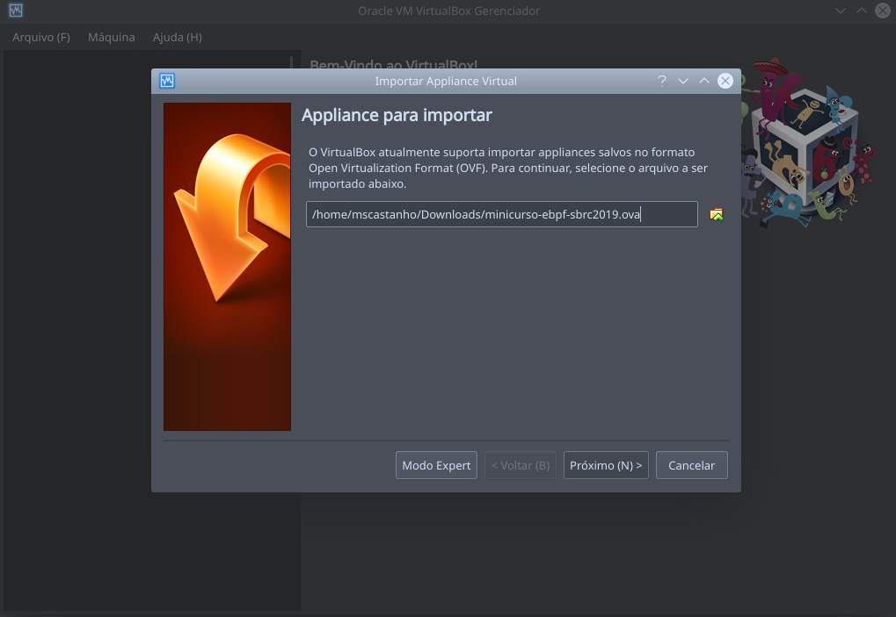
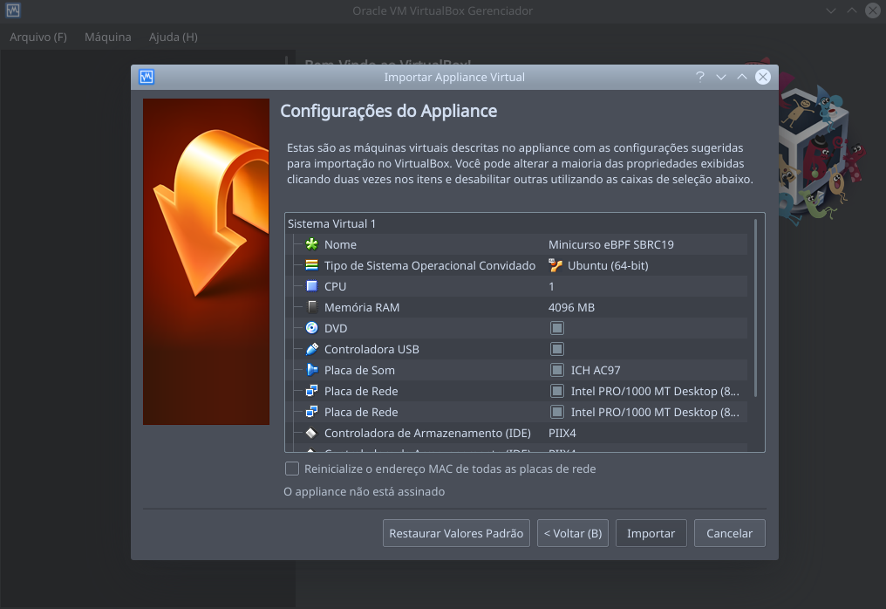
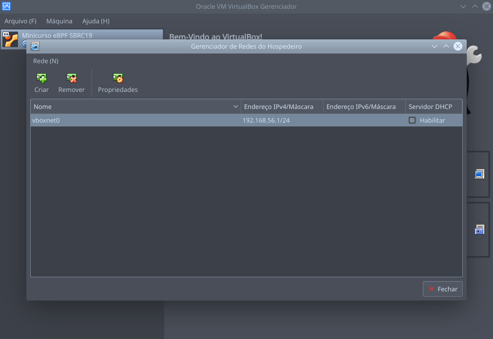

# Tutorial sobre extended Berkeley Packet Filter (eBPF)

Este repositório contém o material utilizado durante a realização do Minicurso sobre eBPF e XDP no [SBRC2019](http://sbrc2019.sbc.org.br/).

## Máquina virtual

Uma máquina virtual foi especialmente desenvolvida para este tutorial, contendo todo o código e ferramentas necessárias para a execução de cada passo.

- [Download VirtualBox VM](http://dcc.ufmg.br/~matheus.castanho/minicurso-ebpf-sbrc2019.rar) (user: *ebpf*, senha: *ebpf*)

A máquina virtual está equipada com os seguintes itens:
- kernel v5.0.0
- iproute2-ss190319
- llvm 6.0.0
- bpftool
    
Além de uma cópia deste repositório, o diretório `/home/ebpf` apresenta cópias locais dos seguintes projetos:
- [Linux kernel net-next](https://git.kernel.org/pub/scm/linux/kernel/git/davem/net-next.git)
- [BPFabric](https://github.com/UofG-netlab/BPFabric)
- [iproute2](https://git.kernel.org/pub/scm/network/iproute2/iproute2-next.git)
- [prototype-kernel](https://github.com/netoptimizer/prototype-kernel.git)

## Importando a máquina virtual

Os passos a seguir foram testados com o VirtualBox 5.2.18 no Ubuntu.

Após fazer o download da imagem, descompacte o arquivo `.rar`. O arquivo resultante será `minicurso-ebpf-sbrc2019.ova`.

Para importar a VM, acesse o menu `Arquivo > Importar Appliance` e selecione o arquivo `.ova` descompactado.

    

Em seguida, o VirtualBox permitirá modificações na especificação da máquina, como quantidade de memória RAM (padrão: 4GB).

    

A máquina foi configurada com 2 interfaces de rede, uma no modo NAT (`eth0` - acesso à internet) e outra no modo HostOnly (`eth1` - acesso por SSH). Após a importação, certifique-se de que uma rede HostOnly `vboxnet0` está criada no VirtualBox, sob o menu `Arquivo > Host Network Manager`.

    

