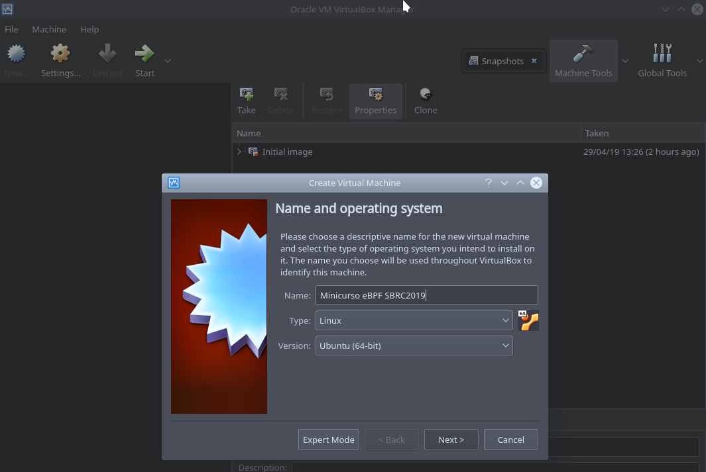
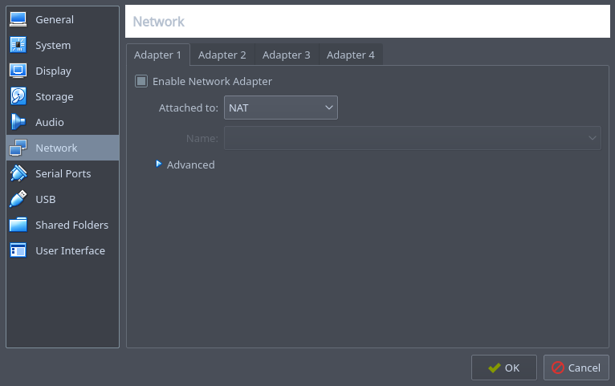
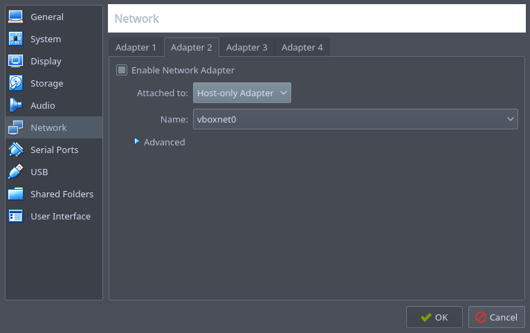

# Tutorial sobre extended Berkeley Packet Filter (eBPF)

Este repositório contém o material utilizado durante a realização do Minicurso sobre eBPF e XDP no [SBRC2019](http://sbrc2019.sbc.org.br/).

## Conteúdo

O conteúdo deste repositório está dividido da seguinte forma:
- `ansible/`: script ansible usado para instalar as dependências necessárias durante a criação da VM
- `exemplos/`: exemplos de programas eBPF utilizados durante o minicurso
- `headers/`: headers necessários para compilação dos programas
- `images/`: imagens utilizadas neste README
- `slides.pdf`: slides com o conteúdo teórico utilizado na apresentação

## Máquina virtual

Uma máquina virtual foi especialmente desenvolvida para este tutorial, contendo todo o código e ferramentas necessárias para a execução de cada passo.

- [Download VirtualBox VM](http://www.winet.dcc.ufmg.br/lib/exe/fetch.php?media=cursos:minicurso_ebpf:minicurso-ebpf-sbrc2019.rar) (user: *ebpf*, senha: *ebpf*)

A máquina virtual está equipada com os seguintes itens:
- kernel v5.0.0
- iproute2-ss190319
- llvm 6.0.0
- bpftool

Além de uma cópia deste repositório, o diretório `/home/ebpf` apresenta cópias locais dos seguintes projetos:
- [Linux kernel net-next](https://git.kernel.org/pub/scm/linux/kernel/git/davem/net-next.git)
- [BPFabric](https://github.com/UofG-netlab/BPFabric)
- [iproute2](https://git.kernel.org/pub/scm/network/iproute2/iproute2-next.git)
- [prototype-kernel](https://github.com/netoptimizer/prototype-kernel.git)

## Importando a máquina virtual

Os passos a seguir foram testados com o VirtualBox 5.2.18 no Ubuntu.

Após fazer o download da imagem, descompacte o arquivo `.rar`. O arquivo resultante será `minicurso-ebpf-sbrc2019.vdi`.

Crie uma nova VM a partir do botão `New` e escolha um nome para a máquina:

<p align="center">
    
</p>

Em seguida, o VirtualBox permitirá modificações na especificação da máquina, como quantidade de memória RAM (esse valor pode ser modificado posteriormente).

<p align="center">
    
</p>

Na próxima etapa o VirtualBox perguntará a opção de disco de rígido desejada. Aqui é preciso utilizar um disco já existente, que corresponde à imagem baixada:

<p align="center">
    
</p>


Por fim, a máquina deve ser configurada com 2 interfaces de rede, uma no modo NAT (`eth0` - acesso à internet) e outra no modo HostOnly (`eth1` - acesso por SSH). Após a criação, clique com o botão direito no nome da VM e selecione `Configurações`. Na aba `Rede` certifique-se de que essas duas interfaces estão criadas:

<p align="center">
    
    </br>
    </br>
    
</p>

Pronto! A máquina está 100% preparada para o tutorial.

## Compilando os exemplos do kernel

O código fonte do kernel apresenta diversos programas de exemplo, disponíveis nos seguintes diretórios:
- `samples/bpf`
- `tools/testing/selftests/bpf`

Neste minicurso apresentaremos dois exemplos presentes na pasta `samples/bpf`. Para compilá-los, execute os seguintes comandos:

    cd ~/net-next/
    make headers_install
    make samples/bpf/

## Compilando os exemplos locais

Os exemplos fornecidos neste repositório na pasta `exemplos/` estão acompanhados de um Makefile. Para compilá-los:

    cd exemplos/
    make

**OBS**: As dependências necessárias para a compilação já estão instaladas na máquina virtual, portanto recomendamos compilar os exemplos naquele ambiente.

## Exemplo 1: Drop World!

Local: `./exemplos/dropworld.c`

Esse exemplo representa um dos programas mais simples possíveis. A sua funcionalidade é simplesmente descartar todos os pacotes recebidos.

Para compilá-lo, utilize o comando `make`:

    cd ./exemplos/
    make

Em seguida, o programa pode ser carregado utilizado a ferramenta `ip`:

    sudo ip -force link set dev eth0 xdp obj dropworld.o sec .text

O argumento `.text`se refere à seção ELF no qual o programa está localizado. Conferir os slides para mais detalhes.

Podemos conferir o status do programa utilizando o seguinte comando:

    ip link show eth0

Output:

    ebpf@sbrc2019:~/bpf-tutorial/exemplos$ ip link show eth0
    2: eth0: <BROADCAST,MULTICAST,UP,LOWER_UP> mtu 1500 xdpgeneric qdisc fq_codel state UP mode DEFAULT group default qlen 1000
    link/ether 08:00:27:58:07:42 brd ff:ff:ff:ff:ff:ff
    prog/xdp id 19

Para removermos o programa, basta executar:

    sudo ip link set dev eth0 xdp off

Após a remoção o status da interface será o seguinte:

    ebpf@sbrc2019:~/bpf-tutorial/exemplos$ ip link show eth0
    2: eth0: <BROADCAST,MULTICAST,UP,LOWER_UP> mtu 1500 qdisc fq_codel state UP mode DEFAULT group default qlen 1000
        link/ether 08:00:27:58:07:42 brd ff:ff:ff:ff:ff:ff

Como nesse caso a interface `eth0` é utilizada para acesso à Internet, o descarte de pacotes recebidos por essa interface efetivamente cortará o acesso à web.

Em um terminal separado, inicie um processo para "pingar" um domínio na internet:

    ping google.com

Em seguida, carregue o programa `dropworld.o` na interface eth0 e veja como a respostas ao ping serão interrompidas. Isso ocorrerá pois todas mensagens de respostas enviadas à interface `eth0` serão descartadas pelo programa carregado.

**Extra**: modifique o arquivo `dropworld.c` e modifique o valor de retorno de `XDP_DROP` para `XDP_PASS`, compile e repita o processo de carregamento. Nesse caso, perceba que as repostas ao ping ainda serão recebidas, de forma que esse novo programa é efetivamente uma operação vazia, que simples recebe e passa os pacotes para cima na pilha do kernel.

## Exemplo 2: Filtragem de pacotes por porta TCP

Local: `./exemplos/portfilter.c`

Este exemplo analisa os pacotes recebidos em uma interface e descarta pacotes com o protocolo HTTP. O descarte é feito por meio da análise dos campos de porta de origem e destino do cabeçalho TCP. Pacotes nos quais um desses valores é igual a 80 são descartados.

Similarmente ao exemplo anterior, compile o programa:

    cd ./exemplos/
    make

Antes de carregar o programa, teste o acesso a uma página web:

    curl http://www.google.com

A saída desse comando deve ser um print do código HTML da página em questão.

Carregue utilizando a ferramenta `ip`:

    sudo ip -force link set dev eth0 xdp obj portfilter.o sec filter

Agora tente novamente acessar a mesma página:

    curl http://www.google.com

Por conta do programa *portfilter.o* o os pacotes serão descartados assim que chegarem à interface `eth0`, impedindo o acesso.

**Extra**: Modifique o arquivo *portfilter.c* para descartar pacotes ICMP (utilizados pela ferramenta `ping`).

## Exemplo 3: Mapas e interação com espaço de usuário

Local: `xdp1_kern.c` e `xdp1_user.c` localizados no diretório `samples/bpf/` do código fonte do kernel (`~/net-next/samples/bpf/` na VM).

Este exemplo demonstra a utilização de mapas em programas eBPF e como fazer a interação com o espaço de usuário. O programa em `xdp1_kern.c` extrai de cada pacote recebido o número do protocolo de camada 4 utilizado (TCP = 6, UDP = 17, ICMP = 1, etc), atualiza um contador para cada protocolo e em seguida descarta o pacote. Esses valores são salvos no mapa `rxcnt`, que é consultado pelo programa `xdp1_user.c`, que executa em espaço de usuário. Por meio do uso de um mapa, os dois programas (um em kernel e outro em espaço de usuário) são capazes de trocar informação.

Para compilar os programas, siga as instruções dadas anteriormente sobre como compilar programas de exemplo do kernel do Linux.

Diferentemente dos exemplos anteriores, aqui o programa eBPF é carregado no kernel pelo programa `xdp_user.c`, em espaço de usuário, sem a necessidade do uso da ferramenta `ip`.

Após a compilação, o diretório `samples/bpf/` conterá o arquivo executável `xdp1`, gerado após a compilação de `xdp_user.c`.

    ebpf@sbrc2019:~/net-next/samples/bpf$ ./xdp1
    usage: xdp1 [OPTS] IFACE

    OPTS:
        -S    use skb-mode
        -N    enforce native mode

Para carregar o programa na interface `eth0` basta passá-la como parâmetro:

    ./xdp1 eth0

O programa entrará em um loop infinito, imprimindo o número de pacotes recebidos por número de protocolo até o momento.

    ebpf@sbrc2019:~/net-next/samples/bpf$ sudo ./xdp1 eth0
    proto 17:          1 pkt/s
    proto 17:          1 pkt/s
    proto 17:          1 pkt/s
    proto 0:          1 pkt/s
    proto 17:          1 pkt/s

Em um outro terminal, faça alguma requisição utilizando as ferramentas `ping`, `curl`, `wget` e afins, para fazer com que pacotes passem pela interface.

É possível analisar o conteúdo do mapa utilizando a ferramenta `bpftool`, já compilada e instalada na VM fornecida. Para isso, primeiramente verificamos os programas eBPF carregados no sistema:

    sudo bpftool prog show

Output:

    ebpf@sbrc2019:~$ sudo bpftool prog show
    2: cgroup_skb  tag 7be49e3934a125ba  gpl
            loaded_at 2019-04-23T12:24:29-0400  uid 0
            xlated 296B  jited 229B  memlock 4096B  map_ids 2,3
    3: cgroup_skb  tag 2a142ef67aaad174  gpl
            loaded_at 2019-04-23T12:24:29-0400  uid 0
            xlated 296B  jited 229B  memlock 4096B  map_ids 2,3
    4: cgroup_skb  tag 7be49e3934a125ba  gpl
            loaded_at 2019-04-23T12:24:29-0400  uid 0
            xlated 296B  jited 229B  memlock 4096B  map_ids 4,5
    5: cgroup_skb  tag 2a142ef67aaad174  gpl
            loaded_at 2019-04-23T12:24:29-0400  uid 0
            xlated 296B  jited 229B  memlock 4096B  map_ids 4,5
    6: cgroup_skb  tag 7be49e3934a125ba  gpl
            loaded_at 2019-04-23T12:24:35-0400  uid 0
            xlated 296B  jited 229B  memlock 4096B  map_ids 6,7
    7: cgroup_skb  tag 2a142ef67aaad174  gpl
            loaded_at 2019-04-23T12:24:35-0400  uid 0
            xlated 296B  jited 229B  memlock 4096B  map_ids 6,7
    28: xdp  name xdp_prog1  tag 539ec6ce11b52f98  gpl
            loaded_at 2019-04-23T14:34:06-0400  uid 0
            xlated 488B  jited 336B  memlock 4096B  map_ids 14

O último programa listado corresponde ao programa XDP carregado por `xdp1`. A saída também indica que ele apresenta um mapa com o id 14. Podemos utilizar esse valor para consultar o conteúdo do mapa:

    sudo bpftool map dump id 14

Output:

    ebpf@sbrc2019:~$ sudo bpftool map dump id 14
    key:
    00 00 00 00
    value (CPU 00): 4b 00 00 00 00 00 00 00
    key:
    01 00 00 00
    value (CPU 00): 00 00 00 00 00 00 00 00
    key:
    02 00 00 00
    value (CPU 00): 00 00 00 00 00 00 00 00
    ...
    (restante da saída omitido)

O mapa utilizado é do tipo `BPF_MAP_TYPE_PERCPU_ARRAY`. Como o nome indica, ele apresenta um vetor por CPU utilizada. Na declaração do mapa, o número de elementos foi definido como `256`, portanto a saída do comando `bpftool` acima mostra 256 entradas correspondentes à CPU 0, única da VM.

**Extra**: Alterar o programa para deixar os pacotes passarem, ao invés de serem descartados. Além disso, mudar o tipo do mapa para `BPF_MAP_TYPE_HASH` e conferir o output com a ferramenta `bpftool`.

## Exemplo 4: Interação entre camadas XDP e TC

Local: `linux/samples/bpf/`: arquivos `xdp2skb_meta_kern.c` e `xdp2skb_meta.sh`

Este exemplo tem como objetivo demonstrar como as camadas XDP e TC podem interagir por meio do uso de metadados associados a um pacote. O arquivo `xdp2skb_meta_kern.c` contém dois programas distintos, um para ser carregado no XDP e outro no TC, ambos na recepção. Os pacotes recebidos pelo XDP recebem um metadado customizado, que é lido na camada TC. O script `xdp2skb_meta.sh` é utilizado para carregar os programas nos respectivos ganchos e configurar o sistema.

Para auxiliar a análise desses programas, bem como demonstrar uma forma alternativa de depurar programas eBPF, vamos modificar o arquivo `xdp2skb_meta_kern.c` para imprimir mensagens de log após o processamento do pacote em cada camada.

Para isso vamos utilizar a função auxiliar `bpf_trace_printk`. Para facilitar o seu uso, podemos adicionar a seguinte macro ao arquivo:

```c
// Nicer way to call bpf_trace_printk()
#define bpf_custom_printk(fmt, ...)                     \
        ({                                              \
            char ____fmt[] = fmt;                       \
            bpf_trace_printk(____fmt, sizeof(____fmt),  \
                    ##__VA_ARGS__);                     \
        })
```

Através dessa macro, podemos utilizar a função `bpf_trace_printk` indiretamente, porém com uma sintaxe similar à função `printf`.

Tendo adicionado a macro, agora podemos utilizá-la para imprimir os valores do metadado nas camadas TC e XDP.

Adicionar ao fim da funçao *_xdp_mark()*:

```c
SEC("xdp_mark")
int _xdp_mark(struct xdp_md *ctx)
{
    struct meta_info *meta;
    void *data, *data_end;
    int ret;

    <...> // código omitido

    meta->mark = 42;

    bpf_custom_printk("[XDP] metadado = %d\n",meta->mark); // <-- Adicionar essa linha

    return XDP_PASS;
}
```

Adicionar ao fim da função *_tc_mark*:

```c
SEC("tc_mark")
int _tc_mark(struct __sk_buff *ctx)
{
    void *data      = (void *)(unsigned long)ctx->data;
    void *data_end  = (void *)(unsigned long)ctx->data_end;
    void *data_meta = (void *)(unsigned long)ctx->data_meta;
    struct meta_info *meta = data_meta;

    <...> // código omitido

    ctx->mark = meta->mark; /* Transfer XDP-mark to SKB-mark */

    bpf_custom_printk("[TC] metadado = %d\n",meta->mark); // <-- Adicionar essa linha

    return TC_ACT_OK;
}
```

Porém a função `bpf_trace_printk` exige que os programas que a utilizam sejam declarados com a licença GPL. Caso contrário, o programa será rejeitado pelo verificador durante o carregamento no kernel. A mensagem gerada pelo verificador é a seguinte:

    ebpf@sbrc2019:~/net-next/samples/bpf$ sudo ./xdp2skb_meta.sh --dev eth0                                                                              [16/1675]

    Prog section 'tc_mark' rejected: Invalid argument (22)!
    - Type:         3
    - Instructions: 25 (0 over limit)
    - License:

    Verifier analysis:

    0: (61) r3 = *(u32 *)(r1 +76)
    1: (61) r2 = *(u32 *)(r1 +140)
    2: (bf) r4 = r2
    3: (07) r4 += 4
    4: (3d) if r3 >= r4 goto pc+3
    R1=ctx(id=0,off=0,imm=0) R2=pkt_meta(id=0,off=0,r=0,imm=0) R3=pkt(id=0,off=0,r=0,imm=0) R4=pkt_meta(id=0,off=4,r=0,imm=0) R10=fp0,call_-1
    5: (b7) r2 = 41
    6: (63) *(u32 *)(r1 +8) = r2
    7: (05) goto pc+15
    23: (b7) r0 = 0
    24: (95) exit

    from 4 to 8: R1=ctx(id=0,off=0,imm=0) R2=pkt_meta(id=0,off=0,r=4,imm=0) R3=pkt(id=0,off=0,r=0,imm=0) R4=pkt_meta(id=0,off=4,r=4,imm=0) R10=fp0,call_-1
    8: (61) r3 = *(u32 *)(r2 +0)
    9: (63) *(u32 *)(r1 +8) = r3
    10: (b7) r1 = 680997
    11: (63) *(u32 *)(r10 -16) = r1
    12: (18) r1 = 0x203d206f64616461
    14: (7b) *(u64 *)(r10 -24) = r1
    15: (18) r1 = 0x74656d205d43545b
    17: (7b) *(u64 *)(r10 -32) = r1
    18: (61) r3 = *(u32 *)(r2 +0)
    19: (bf) r1 = r10
    20: (07) r1 += -32
    21: (b7) r2 = 20
    22: (85) call bpf_trace_printk#6
    cannot call GPL-restricted function from non-GPL compatible program

    Error fetching program/map!
    Unable to load program
    ERROR: Exec error(1) occurred cmd: "tc filter add dev eth0 ingress prio 1 handle 1 bpf da obj ./xdp2skb_meta_kern.o sec tc_mark"

Para superar essa limitação, precisamos declarar uma variável global especial na seção ELF `license` com essa informação. Basta adicionar a seguinte linha ao fim do arquivo `xdp2skb_meta_kern.c`:

```c
char _license[] SEC("license") = "GPL";
```

Por fim, recompilamos o exemplo:

    cd ~/net-next
    make samples/bpf/

Em seguida, basta executarmos o script `xdp2skb_meta.sh` para carregarmos os programas no kernel:

    ebpf@sbrc2019:~/net-next/samples/bpf$ sudo ./xdp2skb_meta.sh

    Usage: ./xdp2skb_meta.sh [-vfh] --dev ethX
    -d | --dev     :             Network device (required)
    --flush        :             Cleanup flush TC and XDP progs
    --list         : ($LIST)     List TC and XDP progs
    -v | --verbose : ($VERBOSE)  Verbose
    --dry-run      : ($DRYRUN)   Dry-run only (echo commands)

    ERROR: Please specify network device -- required option --dev

Carregando os programas na interface `eth0`:

    ./xdp2skb_meta.sh --dev eth0

Também podemos carregar os programas diretamente, utilizando as ferramentas `ip` para o programa XDP, como feito anteriormente, e `tc` para o programa no gancho TC. Nesse último caso, é necessário criar uma `qdisc` especial no controlador de tráfego do Linux, chamada `clsact`. Todo esse processo pode ser feito utilizando os seguintes comandos:

    tc qdisc add dev eth0 clsact
    tc filter add dev eth0 ingress bpf da obj xdp2skb_kern.o sec tc_mark

Para mais informações sobre eBPF no gancho TC, confira o comando `man tc-bpf`.

Com os programas carregados em seus respectivos ganchos, podemos analisar as mensagens de log geradas por cada um no arquivo `/sys/kernel/debug/tracing/trace`:

    sudo cat /sys/kernel/debug/tracing/trace

Para fazer uma leitura contínua, utilize o arquivo `trace_pipe`:

    sudo cat /sys/kernel/debug/tracing/trace_pipe

Com os programas eBPF carregados no kernel e com algum tráfego fluindo pela interface, podemos observar as mensagens geradas:

    ebpf@sbrc2019:~/net-next/samples/bpf$ sudo cat /sys/kernel/debug/tracing/trace
    # tracer: nop
    #
    # entries-in-buffer/entries-written: 40/40   #P:1
    #
    #                              _-----=> irqs-off
    #                             / _----=> need-resched
    #                            | / _---=> hardirq/softirq
    #                            || / _--=> preempt-depth
    #                            ||| /     delay
    #           TASK-PID   CPU#  ||||    TIMESTAMP  FUNCTION
    #              | |       |   ||||       |         |
            <idle>-0     [000] ..s. 13699.213984: 0: [XDP] metadado = 42
            <idle>-0     [000] ..s. 13699.214009: 0: [TC] metadado = 42
            <idle>-0     [000] ..s. 13699.421529: 0: [XDP] metadado = 42
            <idle>-0     [000] ..s. 13699.421542: 0: [TC] metadado = 42
            <idle>-0     [000] ..s. 13704.450195: 0: [XDP] metadado = 42
            <idle>-0     [000] ..s. 13704.450205: 0: [TC] metadado = 42
            <idle>-0     [000] ..s. 13704.450216: 0: [XDP] metadado = 42

Pelas mensagens geradas podemos ver que o metadado adicionado no gancho XDP pôde ser recebido pelo programa no gancho TC, efetivamente compartilhando informação entre as duas camadas da pilha do kernel.

## Exemplo 5: Adição de um novo mapa ao BPFabric

Local: Arquivos `foo_map.c`, `foo_map.h`, `foo_counter.c` e `foo_counter.py` localizados no diretório `./exemplos/BPFabric`.

Este exemplo mostra os passos necessários para se incluir um novo mapa ao BPFabric.

O mapa a ser incluído, referenciado aqui como *FOO\_MAP*, é bem simples, sendo ele composto apenas de um contador inteiro de 32 bits. Sua definição pode ser encontrada nos arquivos `foo_map.h` e `foo_map.c`. No arquivo `foo_map.h` encontramos as assinaturas das funções definidas para o *FOO\_MAP*, enquanto no `foo_map.c` encontramos as implementações delas. São elas:
* `foo_map_alloc`: responsável pela alocação da estrutura do mapa, ou seja, do contador.

* `foo_map_free`: responsável pela desalocação da estrutura do mapa.

* `foo_map_update_elem`: responsável por incrementar o valor do contador em 1 a cada chamada.

* `foo_map_lookup_elem`: responsável por recuperar o valor do contador.

O primeiro passo para incluir o *FOO\_MAP* é adicionar seu código fonte (`foo_map.c` e `foo_map.h`) ao diretório do BPFabric no qual se encontram as definições dos mapas disponíveis (`~/BPFabric/bpfmap`).

O segundo passo consiste em adicionar uma referência ao mapa à lista dos tipos de mapas disponíveis. Isto é feito através da adição de uma nova opção ao enum `bpf_map_type` (definida no arquivo `~/BPFabric/bpfmap/bpfmap.h`). O nome desta opção será posteriormente utilizado para se referir ao novo mapa. Se o referenciarmos como `BPF_MAP_TYPE_FOO` e adicionarmos essa opção ao `bpf_map_type`, o enum deverá ficar da seguinte forma:

```c
enum bpf_map_type {
    BPF_MAP_TYPE_UNSPEC,
    BPF_MAP_TYPE_HASH,
    BPF_MAP_TYPE_ARRAY,
    BPF_MAP_TYPE_FOO,
};
```

No próximo passo mapeamos as referências das funções do *FOO\_MAP* para as operações oferecidas pela máquina eBPF do BPFabric. O mapeamento é feito editando o arquivo `~/BPFabric/bpfmap/bpfmap.c`. Primeiro precisamos incluir nele o arquivo header do novo mapa (`#include "foo_map.h"`) para que as referências possam ser encontradas. Em seguida devemos localizar o vetor `bpf_map_types` no arquivo. Os elementos desse vetor são do tipo struct `bpf_map_ops` (definida no arquivo `~/BPFabric/bpfmap/bpfmap.h`), que define as operações disponíveis para um mapa. O mapeamento das funções do *FOO\_MAP* deve adicionar um novo elemento ao vetor e associar as funções definidas no arquivo `foo_map.h` aos campos da struct `bpf_map_ops`. Uma forma de fazer isso é adicionar o seguinte elemento:

```c
[BPF_MAP_TYPE_FOO] = {
    .map_alloc = foo_map_alloc,
    .map_free  = foo_map_free,
    .map_lookup_elem = foo_map_lookup_elem,
    .map_update_elem = foo_map_update_elem,
}
```

É possível observar que, diferente dos demais elementos, esse não atribui referências para os campos `map_get_next_key` e `map_delete_elem`. Isto acontece pois não definimos funções para essas operações. Dessa forma, o usuário não terá acesso a essas operações quando utilizar esse mapa.

Movendo para o próximo passo, precisamos adicionar a referência aos arquivos fonte para que o *FOO\_MAP* possa ser compilado. Isto é feito editando o arquivo `~/BPFabric/bpfmap/Makefile` e adicionando o nome do arquivo fonte (`foo_map`) na variável `bpfmap_mods`:

```
bpfmap_mods += foo_map
```

Por último, precisamos adicionar uma referência global ao mapa. Uma forma de se fazer isto é adicionar uma definição ao arquivo `BPFabric/includes/ebpf_consts.h`. Esta definição deve relacionar o nome do mapa (`BPF_MAP_TYPE_FOO`) à sua posição no enum `bpf_map_type` (no caso 3). Assim, basta incluir a seguinte linha ao arquivo:
```c
#define BPF_MAP_TYPE_FOO 3
```

Agora basta compilar o código adicionado. Para isto, basta executar os seguintes comandos:

```
cd ~/BPFabric
make
```

**Teste**: A fim de verificar se o procedimento de inclusão do mapa foi bem sucedido, podemos executar um exemplo que utilize o *FOO\_MAP*. Os arquivos `foo_counter.c` e `foo_counter.py` foram preparados exatamente para isto. Enquanto o primeiro arquivo define o comportamento do switch, o segundo representa a aplicação controladora.
O programa definido em `foo_counter.c` utiliza a função de atualização do *FOO\_MAP* para incrementar o contador do mapa a cada novo pacote trafegado na rede. Ele também envia ao controlador o valor corrente do contador a cada novo pacote.

Para podermos executar o exemplo, o arquivo `foo_counter.c` deve ser adicionado ao diretório `~/BPFabric/examples` e o arquivo `foo_counter.py` ao diretório `~/BPFabric/controller`.
Deve-se então compilar o programa para o switch fazendo:

```
cd ~/BPFabric/examples
make
```

Deverá ser gerado um arquivo objeto `foo_counter.o`. Em seguida, acesse a pasta `~/BPFabric/mininet` e execute o script `1sw_topo.py`. Ele deverá criar uma rede de testes com um switch e 2 *hosts* e então dar acesso à interface de comandos do Mininet.

Com a rede já criada, execute o controlador através dos comandos

```
cd ~/BPFabric/controller/
python foo_counter.py
```

Ao executar, o controlador primeiro se encarregará de enviar o código compilado (`foo_counter.o`) para o switch, que deverá então ter seu comportamento definido por ele. Depois ficará esperando por notificações do switch sobre o valor do contador.

Para verificar que a aplicação funciona corretamente, execute um comando de `ping` entre os *hosts* no Mininet (por exemplo `h1 ping h2`) e observe que o controlador imprime no terminal a quantidade de pacotes que passaram pelo switch.

    ebpf@osboxes:~/BPFabric/controller$ python foo_counter.py 
    Connection from switch 00000001, version 1
    Installing the eBPF ELF
    contador:    1 pacote(s)
    contador:    2 pacote(s)
    contador:    3 pacote(s)
    contador:    4 pacote(s)
    contador:    5 pacote(s)
    contador:    6 pacote(s)
    contador:    7 pacote(s)
    contador:    8 pacote(s)
    contador:    9 pacote(s)
    contador:   10 pacote(s)
    contador:   11 pacote(s)
    ...
    (restante da saída omitido)
